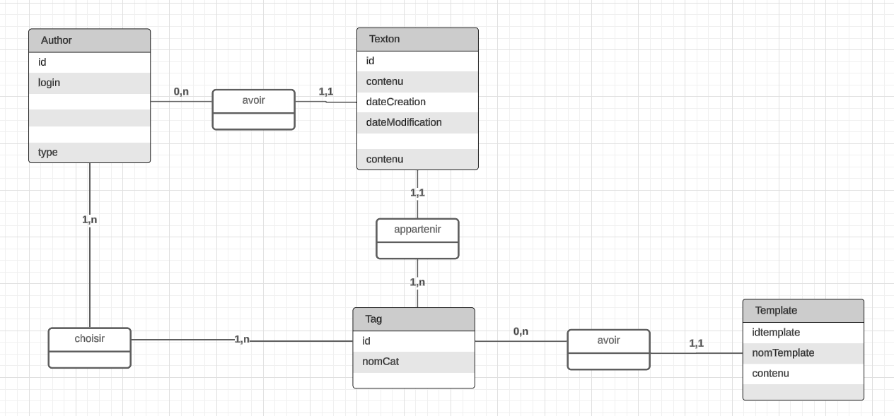
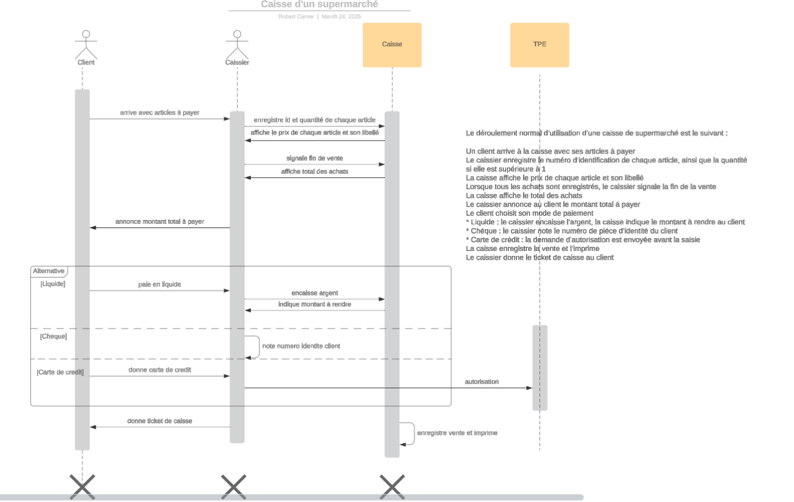

---
title: Rapport du projet Jourdebord
author: Robert Carver
header-includes: |
    \usepackage{fancyhdr}
    \pagestyle{fancy}
    \fancyhead[CO,CE]{ * }
    \fancyfoot[CO,CE]{Projet Jourdebord}
    \fancyfoot[LE,RO]{\thepage}
abstract: Présentation du projet Jourdebord réalisé pour le titre professionnel de Concepteur développeur d'applications . . .
...

***

# Introduction

Ce document décrit l’ensemble du travail que j’ai réalisé pendant la formation de Concepteur développeur d’applications pour produire l’application Jourdebord, une application pour l’écriture et la prise de notes.

La conception et le développement de l’application ont suivi le chemin traité dans notre cours, un parcours itératif commençant avec une idée et une expression de besoins sous forme de cahier des charges rudimentaire, passant par une réponse sous la forme de spécification fonctionnelle, puis de maquettage, ensuite de modélisation via deux méthodologies différentes, puis un choix d'architecture et de technologies, du développement logiciel, des tests, et la mise en production, le tout dans le cadre d’une gestion de projet.

Tout au long de ce document, on présente deux choses en parallèle : la théorie générale de la conception et du développent d'applications enseignée pendant le cours, et son application spécifique pour la réalisation de l'application Jourdebord.

# Description de la formation

## Le titre

RNCP 37873

### Objectifs et contexte de la certification

Le concepteur développeur d'applications conçoit et développe des applications sécurisées, tels que des logiciels d'entreprise, des applications pour mobiles et tablettes, ainsi que des sites Web. Il respecte la réglementation en vigueur, identifie les besoins en éco-conception et applique les procédures qualité de l'entreprise. Il contribue à la réussite du projet en termes de satisfaction des besoins des utilisateurs, gestion de projet, qualité, coût et délai. La sécurité de l'application est pour lui une préoccupation constante.

### Activités visées

Le concepteur développeur d'applications est l'interlocuteur privilégié du client pour la conception et le développement du projet informatique. Il dialogue avec lui afin de connaître les besoins des utilisateurs. Il adapte sa communication à ses différents interlocuteurs et contextes professionnels, y compris en présence d'une personne en situation de handicap. La communication orale peut se faire en anglais, en particulier avec des prestataires de service.

En analysant le cahier des charges du projet informatique, il identifie les fonctionnalités ou les évolutions de l'application. Dans le respect des recommandations de sécurité émise par l'agence nationale de la sécurité des systèmes d'information (ANSSI), il conçoit des applications sécurisées en utilisant une architecture logicielle multicouche et rédige le dossier de conception.

Le concepteur développeur d'applications développe les interfaces utilisateur et les traitements métier de l'application avec des composants sécurisés. Il conçoit ou modifie le modèle des données de l'application, permettant la création ou la modification des bases de données. Il réalise les accès aux données et leurs mises à jour, en assurant leur sécurité et leur confidentialité.

Il rédige et exécute le plan de tests, prépare et documente le déploiement de l'application et contribue à la mise en production dans une démarche DevOps en collaboration avec l'équipe de production.

Le concepteur développeur d'applications met en place les mentions légales liées au règlement général sur la protection des données (RGPD). Il se réfère au référentiel général d'amélioration de l'accessibilité (RGAA) dans la réalisation des maquettes des interfaces utilisateur et leur enchaînement et répond aux besoins des personnes en situation de handicap.

Le concepteur développeur d'applications adopte une démarche structurée de résolution de problème adaptée en cas de dysfonctionnement de l'application, y compris en cas d'incident survenant en production. Il met en place une veille informatique afin de connaître les évolutions techniques et de répondre aux problématiques de sécurité des technologies qu'il utilise.

Il communique en anglais pour l'expression écrite, compréhension écrite et compréhension orale au niveau B1 (utilisateur indépendant) et pour l'expression orale au niveau A2 (utilisateur élémentaire) du cadre européen commun de référence pour les langues (CECRL).

Pour les projets de petite taille ou au sein de petites entreprises, il peut mener en autonomie l'intégralité de la réalisation de l'application, en lien avec le client. Dans le cas de moyens et de grands projets, il travaille soit au sein d'une équipe hiérarchisée sous la responsabilité d'un chef de projet, soit en équipe pluridisciplinaire pour les projets utilisant une méthode itérative de type agile

Le concepteur développeur d'applications est en relation avec le client, les utilisateurs, ainsi qu'avec différents collaborateurs ou experts : chef de projet, architecte logiciel, testeurs, responsable de la sécurité des systèmes d'information (RSSI), administrateur de base de données (DBA), hébergeur, experts techniques, experts métier, équipes chargées de l'exploitation de l'architecture du système d'information (Operations), développeurs et les autres concepteurs développeurs d'applications.

Le concepteur développeur d'applications peut travailler en tant que salarié d'une entreprise, y compris les entreprises de solutions logicielles, pour un client de l'entreprise de services numériques (ESN) qui l'emploie, ou en tant qu'indépendant directement pour un client.

L'emploi nécessite une station assise prolongée et un travail continu sur écran. Il assure sa mission dans des entreprises et des contextes professionnels divers. Il peut être amené à effectuer des déplacements professionnels et à travailler à distance.

### Compétences attestées

#### Développer une application sécurisée

Installer et configurer son environnement de travail en fonction du projet.

Développer des interfaces utilisateur

Développer des composants métier

Contribuer à la gestion d'un projet informatique

#### Concevoir et développer une application sécurisée organisée en couches

Analyser les besoins et maquetter une application

Définir l'architecture logicielle d'une application

Concevoir et mettre en place une base de données relationnelle

Développer des composants d'accès aux données SQL et NoSQL

#### Préparer le déploiement d'une application sécurisée

Préparer et exécuter les plans de tests d'une application

Préparer et documenter le déploiement d'une application

Contribuer à la mise en production dans une démarche DevOps

## Le cours

La formation de Concepteur développeur d’applications s'est déroulée sur une période de 20 semaines de cours en présentiel, du 9 octobre 2023 au 23 février 2024, à l'école _La Grande Classe_ de Montreuil.

Page Web de l'école décrivant la formation :

> Titre RNCP Concepteur Développeur d’Applications (Bac +3)

> https://lagrandeclasse.fr/concepteur-developpeur-dapplication/

# Idée d'application : cahier des charges

Idée, contexte, objectifs, existant, cible...

## L'idée

Jourdebord est une application de prises de notes inspirée entre autres du journal de bord tenu par un capitaine de navire ou de vaisseau spatial.

Plus précisément, le "elevator pitch" c'est :

> une appli Web de prise de notes recherchables (interrogeables) avec tracking (contrôle) d'habitudes (de pratiques)

Le projet commence avec une idée qui revient à une expression des besoins.

## Contexte du projet

Nos vies contiennent beaucoup d’événements dont nous pouvons vouloir garder la trace. Garder une trace de ces événements permet de se souvenir et de prévoir.

Nous utilisons divers outils électroniques ou non pour gérer nos vies, en garder des traces, et prévoir. Appareil à photo, agenda, calepin, etc. Nous avons aussi des messageries et des réseaux sociaux où nous publions des informations parfois publiques et parfois restreintes à certains publics proches. Et il peut arriver de faire des notes personnelles, par exemple dans le contexte de son occupation professionnelle ou lors d’un voyage.

Jourdebord ambitionne d’être un outil de prise de notes textuelles qui réponde à et complète tous ces cas de figure de traces d’événements ou de notes de notre vie.

## Objectifs de l’outil

Facile et rapide à utiliser : Jourdebord doit rendre possible de prendre une note de manière quasi instantanée sur tous types d’appareils allant de l’ordinateur de bureau au téléphone portable.

Sécurisé et confidentiel : Jourdebord garantit à son utilisateur la confidentialité et la sécurité des données qu’il ou elle enregistre dans l’application.

Recherche facile : Jourdebord permet de facilement et rapidement retrouver les informations qui lui sont confiées, présentées de manière pratique et lisible.

Intégrable avec d'autres applications : Jourdebord peut intégrer un événement enregistré par une autre application, comme par exemple un voyage guidé par un logiciel de navigation, une invitation par message, ou l'utilisation d'un appareil connecté.

## Étude de l’existant

Les outils d’écriture font foison : les premiers outils de traitement de texte furent développés il y a un demi-siècle. Et de nos jours nous écrivons tous des messages ou des notes de toutes sortes sur nos téléphones portables.

Parmi l’infinité d’outils potentiellement concurrents, nous en avons choisi trois pour faire une comparaison : l’outil de traitement de texte Google Docs, l’outil de prise de notes Apple Notes, et l’outil d’écriture 750words.com.

### Google Docs : 

Un outil qui permet d’écrire et de publier des documents de qualité professionnelle, comparable à Microsoft Word.
 
Avantages : gratuit, en réseau, mise en page

Inconvénients : pas orienté recherche de texte, un peu lourd à utiliser pour prendre des notes

### Apple Notes : 

Un outil conçu pour prendre des notes rapides sur un appareil mobile Apple.

Avantages : disponible sur son téléphone, prise de notes rapides, graphiques et mise en page

Inconvénients : peu disponible hors plateforme Apple, pas orienté recherche de texte

### 750words.com : 

Un outil peu connu qui encourage la pratique de l’écriture.

Avantages : simplicité, suivi des statistiques, gamification

Désavantages : pas de recherche facile, pas de manière d’organiser ses notes autre que chronologique

### Jourdebord : 

L’application que j’ai développée orientée prise de notes et suivi quotidien.

Avantages : rapide et facile de prendre des notes, recherche et catégorisation des notes

Désavantages : encore en phase de développement et de tests, fonctionnalités non encore implémentées, pas de business model

### Tableau comparatif

| Appli    | Avantages                              | Inconvénients                             | Commentaires                       |
|-----------------|----------------------------------------|-------------------------------------------|------------------------------------|
| Google Docs     | gratuit, en réseau, mise en page       | pas orienté recherche de texte, un peu lourd à utiliser pour prendre des notes |                                    |
| Apple Notes     | disponible sur son téléphone, prise de notes rapides, graphiques et mise en page | peu disponible hors plateforme Apple, pas orienté recherche de texte |                                    |
| 750words    | simplicité, suivi des statistiques, gamification | pas de recherche facile, pas de manière d’organiser ses notes autre que chronologique |                                    |
| Jourdebord      | rapide et facile de prendre des notes, recherche et catégorisation des notes | encore en phase de développement et de tests, fonctionnalités non encore implémentées, pas de business model |                                    |

## Cible

L'application cible deux types de personnes : 

1. Les personnes qui veulent garder une trace de leurs activités.

2. Les personnes qui souhaitent écrire.

# Spécifications fonctionnelles

La réponse au cahier des charges (idée) prend la forme de spécifications.

Dans cette phase et la phase suivante de maquettage, on rédige, en échangeant avec le client, une espèce de manuel utilisateur de la future application que l'on va s'engager à développer.

On commence par aller dans le détail en spécifiant les fonctionnalités et les contraintes de qualité que doit satisfaire l’application.

## Fonctionnalités

On fait la liste des fonctionnalités à réaliser en les priorisant, car il y a toujours plus de fonctionnalités envisageables qu’il n'est possible de réaliser.

La méthode dite "MoSCoW" est un moyen de prioriser les tâches à accomplir.
Elle utilise des termes parlants pour communiquer avec le client : 

- M must : doit être fait, important mais pas indispensable
- S should : à faire mais app livrable même si non réalisé
- C could : à faire si on a le temps
- W won't : ne sera pas fait -- cette fois-ci

### Fonctionnalités Must have :

- Authentification, inscription, login, logout
- Textes: création, consultation, mise à jour, suppression (CRUD)
- Tags : CRUD

- Recherche de texte :
  - recherche par date, par mot ou phrase
  - tous les textes, textes d’une certaine date
  - résultats ordonnés par date de création, date de dernière mise à jour

### Fonctionnalités Should have :

- Affichages de texte :
  - afficher le texte par heure, jour, semaine, mois, total
  - afficher texte complet, fragment de texte

- Templates : CRUD

- Partage de texte : rendre un texte public avec une URL

- Statistiques de texte :
  - nombre de mots par jour, semaine, mois, total
  - mots les plus utilisés

- API, accès "headless" pour d'autres interfaces, par exemple :
  - création via bouton
  - affichage de type tableau de bord

### Fonctionnalités Could have :

- Nuages de mots
- Localisation : interface de l'application en autre chose que français
- L'admin ne doit pas pouvoir lire les textes des autres !

### Fonctionnalités Won’t have :

- Attribution automatique de catégories
- Création automatisée de templates
- Badges et gamification :
    - badge vous avez écrit 1000 mots, 
    - vous avez commencé à écrire tôt, 
    - vous avez écrit tous les jours depuis 1 semaine, ...
    - ...

## Spécifications non fonctionnelles ou contraintes de qualité

### Qualité de l’interface

#### Ergonomie

La mise en page du site pour son utilisation au jour le jour doit satisfaire deux critères ergonomiques, selon le type d’utilisation : 

Pour la prise de notes, l’interface du site doit quasiment disparaître pour laisser l’utilisateur saisir du texte rapidement et en toute sécurité

Pour la recherche dans les notes, l’interface doit faciliter la recherche rapide selon un vaste nombre de critères

#### Graphisme

Les couleurs et les polices de caractère sont sobres, élégants, et légèrement “rétro”, de style “manuscrit”, en accord avec le principe de l’écriture.

Comme c’est un outil à utilisation très personnelle, il pourrait être souhaitable de pouvoir en configurer la présentation pour qu’elle soit conforme aux préférences esthétiques de l’auteur.

### Performances

L’application doit être disponible à tout moment, avec un temps de réponse instantané, ne pas avoir de ralentissements, et doit pouvoir fonctionner hors ligne, sans connection Internet. 

Les éventuels conflits dans les données doivent être traités. 

L’intégrité des données textuelles doit être préservée, et il ne faut jamais risquer de perdre des données.

### Sécurité

Les données textuelles de chaque utilisateur doivent n’être visibles que par cet utilisateur, et personne d’autre.

Idéalement, même l’administrateur de l’application ne devrait pas pouvoir lire les données des utilisateurs.

Le site et ses données doivent être protégés contre toute attaque. 

Le site de l’application doit appliquer toutes les bonnes pratiques pour être protégé contre les hackers : sécurité des mots de passe, etc. 

Même en cas de pénétration, les données doivent être inaccessibles à tout agent malveillant.

# Maquettage

Le maquettage permet de visualiser la conception et les fonctionnalités de l’application avant de la développer. C’est un outil de communication entre les différents participants du projet : le client, le product owner, le chef de projet, le designer et les développeurs.

Avec l’outil Figma, j’ai réalisé le zoning, les wireframes, la charte graphique (couleurs et polices), les maquettes de pages et un prototype montrant les transitions entre pages.

## Zoning

Le zoning consiste à définir et positionner les différentes zones fonctionnelles communes à la plupart des pages web de l'appli.
On définit et positionne les différentes zones fonctionnelles de la page web.
On identifie les grandes zones de l'interface, comme l'en-tête, le menu, le contenu principal, et le pied de page.
On positionne ces zones pour faciliter l'expérience utilisateur et pour que l'interface et la navigation soient lisibles et régulières.

## Wireframe

Le wireframe ajoute des détails au zoning en précisant la disposition des éléments sans préciser l'aspect graphique.
Le wireframe établit un squelette du site. C'est une représentation minimale du site pour que les participants au développement
de l'application puissent avoir une représentation commune du futur produit.

## Charte graphique

Effet désiré : outil d'écriture (style ancien ou moderne ou les deux ?), couleurs, polices, ...

[ràf]

## Maquettes de pages

[ràf]

## Prototype avec transitions entre pages

[ràf]

# Analyse et conception

C’est dans la phase d’analyse et de conception qu’on fait les choix qui affecteront toute la réalisation du projet. 

On a étudié deux méthodes de conception partiellement redondantes mais aussi relativement complémentaires, Merise et UML. Donc je présente ici l’application de ces deux méthodes et leurs diagrammes associés.

## Merise

La méthodologie Merise est une méthode d'analyse et de conception de systèmes d'information. Elle repose sur une approche structurée et modulaire, permettant de modéliser les données, les traitements et l’organisation d’un système. Merise utilise trois niveaux de représentation : le niveau conceptuel, le niveau logique et le niveau physique. Le niveau conceptuel se concentre sur l’analyse des besoins et la modélisation des données, tandis que le niveau logique traduit ces concepts en modèles plus techniques, et le niveau physique est orienté vers la mise en œuvre concrète du système sur un support informatique. Cette méthode est particulièrement efficace pour gérer la complexité des projets, car elle sépare clairement les différentes étapes de la conception.

Merise permet de modéliser les données utilisées par un système : leur nature et leurs relations entre elles. 

### Règles de gestion

Dans la méthodologie Merise, les règles de gestion sont des contraintes et des conditions qui régissent le fonctionnement du système d’information, en définissant comment les données doivent être manipulées et traitées. Elles traduisent les exigences métiers et sont essentielles pour garantir que le système respecte les politiques et les processus de l'organisation. Ces règles peuvent porter sur des conditions de validité des données, des calculs, des autorisations d'accès, ou encore des enchaînements de traitements. Dans Merise, les règles de gestion sont spécifiées au niveau conceptuel, et sont ensuite prises en compte lors de la modélisation logique et physique pour s'assurer que le système développé réponde fidèlement aux besoins exprimés.

### Dictionnaire de données

Dans la méthodologie Merise, le dictionnaire de données est un outil de documentation qui centralise et décrit l'ensemble des données utilisées dans le système d'information. Il détaille les caractéristiques de chaque donnée (comme le type, la taille, le format, les contraintes et les règles de validation) ainsi que leur signification métier. Le dictionnaire de données facilite la communication entre les différents intervenants du projet en fournissant une référence commune et contribue à assurer la cohérence des données tout au long du cycle de développement. Il est également utile pour identifier les dépendances entre les données et les traitements dans le système, ce qui est essentiel pour la maintenance et l'évolution du système.

### Modèle conceptuel de données

Le Modèle Conceptuel de Données (MCD) est une étape clé de la méthodologie Merise, qui permet de représenter de manière abstraite les données d’un système d’information ainsi que leurs relations, indépendamment des contraintes techniques de mise en œuvre. Le MCD se concentre sur les objets métier, appelés entités, et leurs relations, en définissant également les attributs des entités (propriétés des données) et les cardinalités (règles de dépendance et d’association entre entités).

L’objectif du MCD est de traduire les besoins métier en un modèle de données logique et compréhensible pour tous les intervenants, tout en assurant la cohérence des informations manipulées par le système. Les entités du MCD deviennent ensuite les tables de la base de données dans le modèle physique, tandis que les relations aident à établir les liens entre ces tables. En d'autres termes, le MCD est un outil d'abstraction permettant de concevoir une base de données stable et bien structurée avant de passer aux phases de conception technique.

Ci-dessous un diagramme représentant le MCD de Jourdebord.

On voit les 4 entités du modèle : Texton, qui contient le texte, Tag, qui contient les catégories, Template, pour les templates, et Author qui contient les différents utilisateurs du système, soit les auteurs et l'administrateur.

### Modèle logique de données

Le Modèle Logique de Données (MLD) est une étape de la méthodologie Merise qui traduit le Modèle Conceptuel de Données (MCD) en une représentation plus technique, proche de la structure de la base de données. Le MLD conserve la structure des entités et des relations définies dans le MCD, mais les adapte aux contraintes d'un Système de Gestion de Bases de Données (SGBD) relationnel. Concrètement, les entités du MCD deviennent des tables, les attributs des colonnes de ces tables, et les relations se transforment en clés étrangères permettant de relier les tables entre elles.

Le MLD tient compte des spécificités techniques comme le type de données (entiers, chaînes de caractères, etc.), les index, les clés primaires et étrangères, et les contraintes d’intégrité (unicité, non-nullité, etc.). Il est donc essentiel pour préparer la création physique de la base de données en s’assurant que le modèle répond aux exigences de performance, de fiabilité et de cohérence. En résumé, le MLD est un modèle de transition entre le conceptuel (MCD) et le physique (implantation réelle dans un SGBD).

### Modèle physique de données

Le Modèle Physique de Données (MPD) est l'étape finale de la conception d'une base de données dans la méthodologie Merise. Il représente la mise en œuvre concrète de la structure de données sur un Système de Gestion de Bases de Données (SGBD) spécifique. À partir du Modèle Logique de Données (MLD), le MPD tient compte des contraintes et particularités techniques du SGBD choisi, comme le langage SQL, les types de données disponibles, l'organisation du stockage et les options de performance.

Dans le MPD, les tables, colonnes, clés primaires et étrangères du MLD sont traduites en instructions de création de tables et d'index dans le langage du SGBD. On y définit aussi des éléments techniques comme les index (pour optimiser les recherches), les contraintes (pour assurer l’intégrité des données), et la gestion des espaces de stockage. Le MPD est donc la dernière étape avant l'implémentation et sert de plan de construction pour la base de données elle-même, en transformant la conception théorique en une structure prête à l’emploi dans l'environnement informatique réel.

## UML

UML, le Unified Modeling Language, est le nom d’un type de modélisation objet qui est l’aboutissement de plusieurs efforts de rationaliser la modélisation objet.

Son avantage principal par rapport à Merise est de ne pas séparer données et traitements, mais au contraire les unir dans la modélisation objet.

### UML : Identification des acteurs

On peut commencer par identifier les acteurs au sens UML.

Les acteurs sont des personnes (ou éventuellement entités non humaines, comme des systèmes externes) qui interagissent avec le système modélisé. 

Dans Jourdebord, il y a trois types d’acteur : l’internaute, l’auteur et l’administrateur.

L’internaute est toute personne visitant le site sans s’être inscrit. C’est un auteur potentiel qui pourra utiliser le site pour s’informer sur l’appli et décider de s’inscrire.

L’auteur est la personne à laquelle l’appli est destinée. Une fois inscrit et authentifié, un auteur pourra écrire des notes et consulter ce qu’il a écrit.

L’administrateur gère le site et répond aux problèmes éventuels.

### UML : Diagramme des cas d’utilisation

Le diagramme de cas d'utilisation représente les interactions entre les acteurs et le système, ce qui en détaille les fonctionnalités.

Les cas d'utilisation servent à décrire ce que le système doit faire sans entrer dans le détail de comment le système le fait. En phase de conception du projet, il identifie les besoins fonctionnels et permet la communication entre les différentes personnes qui participent à la conception : client, concepteur, designer.

Avant de faire le diagramme, on peut décrire les cas d'utilisation de manière textuelle.

Nous listons ici 5 cas d'utilisation pour Jourdebord, définissant les quelques fonctionnalités principales et essentielles de l'application.

TODO : rendre les descriptions plus générales, sans mentionner détail des noms d'objets. Et c'est quoi un Measure au fait ?

#### Authentification du User.

Le User saisit login et mot de passe. Si ces informations sont correctes, le User a accès aux fonctionnalités du système. Sinon, le système lui demande de saisir des informations correctes. Le User peut demander une aide pour se connecter, qui lui est envoyée à son adresse email.

#### Le User crée et rédige un TextFragment dans une ou plusieurs Category spécifique(s).

Pendant la rédaction du texte, les Template en rapport avec la ou les Category sont affichés disponibles, et les Measure en rapport avec la ou les Category sont affichés.

#### Le User fait une recherche dans les TextFragment par date ou par pattern.

Les TextFragment sont affichés de plusieurs manières : compact, plein texte, pour mise à jour, ou pour affichage (impression ou visualisation en ligne partagée ou non).

#### Le User fait une mise à jour d'un TextFragment.

La mise à jour peut se faire de la même manière que le User fait la rédaction du texte lors de la création. Les différentes versions du TextFragment sont préservées avec leur date de dernière modification.

#### Le User fait une suppression d'un TextFragment.

La suppression se fait après confirmation. Une fois supprimé, le TextFragment n'apparaît plus dans les recherches par date et par pattern. On pourra, pendant un certain temps, récupérer les TextFragment supprimés en les cherchant dans une "corbeille".

Ci-dessous le diagramme de cas d'utilisation. TODO: mettre le bon diagramme !

### UML : Diagramme de séquence

Le diagramme de séquence ajoute une dimension temporelle et dynamique au cas d'utilisation.

En complement au "quoi" des cas d'utilisation, le diagramme de sequence montre “comment” les éléments du système collaborent pour réaliser un cas d’utilisation, en détaillant l’ordre des messages ou des appels.

Comme dans le diagramme de cas d’utilisation, les acteurs sont souvent a l'origine des interactions.

L’axe vertical du diagramme représente la progression chronologique, du haut vers le bas.

Les elements du systeme, acteurs ou objets, sont représentés par des rectangles verticaux, avec une ligne de vie montrant leur existence dans le temps.

Des flèches horizontales entre les lignes verticales représentent les échanges entre les acteurs et les eleemnts du systeme. Ces echanges peuvent etre sous la forme d'appels de méthodes ou de réponses. Ils peuvent être synchrones (attente de réponse) ou asynchrones.

Des barres fines sur les lignes de vie, montrent quand un objet est actif ou traite une demande.

Ce diagramme sert a analyser les cas d'utilisation, valider la logique des interactions et faciliter la conception technique.

Ci-dessous un diagramme de séquence pour Jourdebord.

### UML : Diagramme de classes

# Mise en œuvre

[à remplir]

## Définition de l’architecture utilisée

[à remplir]

## Outils et frameworks utilisés

[à remplir]

## Interfaces de l’application

[à remplir, et je dois essayer de déterminer ce que ça veut dire ça...]

# Conduite de projet

La conception et le développement du projet s’est faite en 3 parties : 

Pré-étude : 

Détermination du cahier des charges, identification des besoins, étude concurrentielle de l’existant.

Conception de l’application : 

Spécification des fonctionnalités et contraintes de qualité (spécifications dites “non fonctionnelles”), maquettage, modélisation UML et Merise.

Développement de l’application : 

Choix des technologies et outils de développement, développement, tests, mise en production.

Work Breakdown Structure

Permet de diviser les tâches à faire sur plusieurs niveaux.

Le work breakdown structure (WBS), aussi appelé organigramme des tâches du projet décompose un projet en une hiérarchie des travaux nécessaires pour le réaliser.

https://fr.wikipedia.org/wiki/Organigramme_des_t%C3%A2ches_du_projet

Planification Gantt

Un diagramme de Gantt permet d’avoir une vue d’ensemble de toutes les tâches de la conception et du développement de l’application, du temps prévu pour chacune des tâches, et des interdépendances entre ces tâches. Il donne à tous les participants (client, product owner, chef de projet, développeurs) une visibilité sur la progression du projet,

Il peut être complété par un diagramme de PERT pour clarifier les dépendances entre les différentes tâches et les points critiques du projet.

[diagramme de Gantt de Jourdebord]

Méthodologie Agile

L'utilisation d’une méthode dite Agile permet de réaliser le projet avec une visibilité pour tous les participants et une réactivité au cours du projet.

# Sécurité

[à remplir]

## Vulnérabilités de sécurité

[à remplir]

# Devops, tests, déploiement, validation client

[à remplir]

# Veille ?

[à remplir ???]

## Veille marketing

[à remplir ???]

## Veille technologique

[à remplir ou à supprimer ce chapitre ?]

## Recherche anglophone

### Explication

[à remplir]

### Traduction

[à remplir]

# Conclusion

## Objectifs

J'avais trois objectifs avec ce cursus :

## 1. Savoir répondre à une question fréquente

Quand quelqu'un me demande :

> Pourrais-tu me faire un site Web ?

pouvoir répondre sans hésiter : Oui !

C'est une question fréquente. J'ai déjà, par le passé, contribué à réaliser des sites Web professionnellement, en collaboration avec d'autres et en travaillant dans une société qui m'employait comme salarié.

Mais grâce à ce cursus, j'ai plus de confiance sur comment répondre à cette question de manière professionnelle. Je pense maintenant être capable de m'engager personnellement et indépendamment sur un résultat chiffrable au niveau de la conception, de la technique, et des délais.

## 2. Faire de mon idée d'application un prototype

Ce prototype Jourdebord, je suis heureux d'en disposer de manière fiable pour ma propre utilisation, en remplacement des outils que j'utilisais précédemment, dont certains sont mentionnés dans la section ci-dessus, ["Étude de l’existant"](#étude-de-lexistant)

J'aimerais aussi pouvoir partager cet outil avec des proches, que cela pourrait intéresser à différents titres. C'est un outil qui, espérons-le, pourrait leur être utile. Ce serait également une forme de bêta-test pour un outil qui n'a encore véritablement été testé que par moi-même.

Enfin, dans un avenir légèrement plus lointain, une fois l'appli éprouvée avec succès par quelques volontaires bienveillants, pourquoi ne pas mettre l'appli à disposition d'un plus large public ? Ceci dans un cadre à définir, avec une solution réaliste de financement durable.

## 3. Obtenir un diplôme en informatique

Je souhaiterais pouvoir justifier de mes compétences, pas juste par mon expérience professionnelle d'autodidacte, mais aussi au niveau académique.

Et si l'occasion se présentait, pouvoir éventuellement poursuivre plus loin mes études en informatique.

Un diplôme me permettrait aussi de justifier de ma capacité à partager mes connaissances en les enseignant.

## En somme

J'espère avoir modestement réussi à accomplir ces objectifs.

Et j'ai hâte d'appliquer ce que j'ai appris concrètement :

* dans le monde du travail,

* et pour mon projet Jourdebord.

